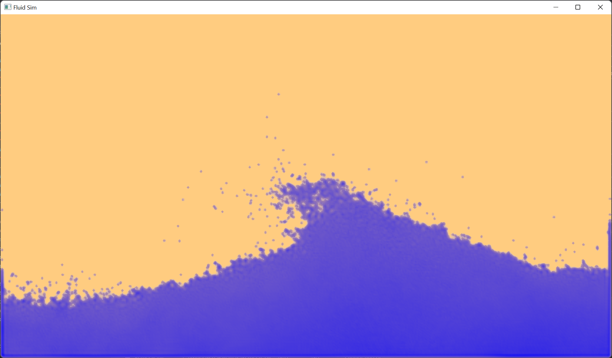
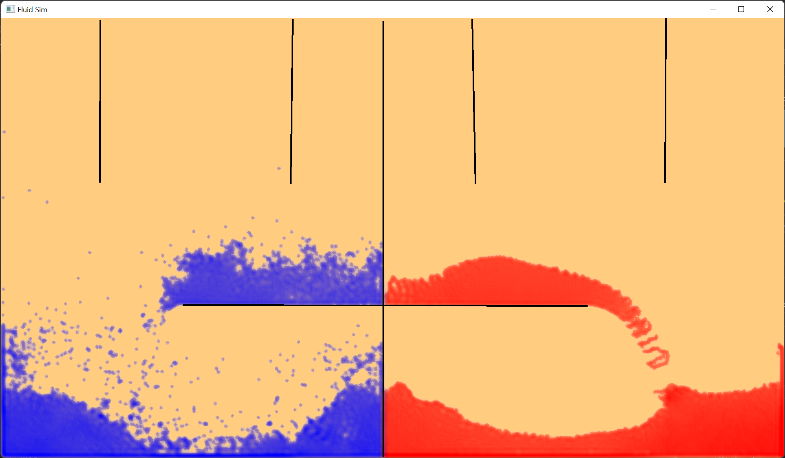
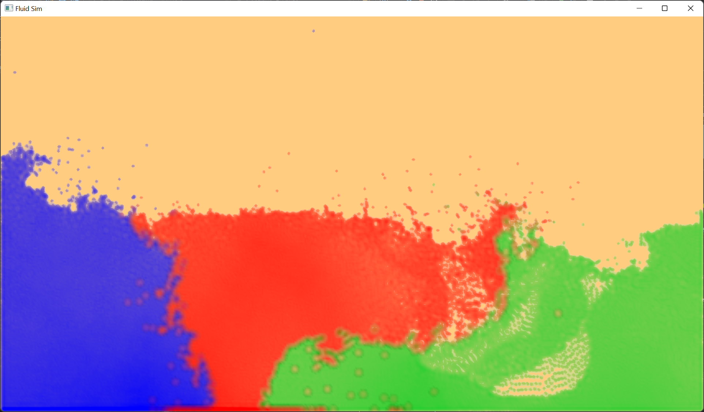

# FluidSimGPU

This is my 3rd project for my computer science degree. It is a real time fluid simulation for demonstrating the properties of fluids.

It was created mainly by following the work of researchers at Nvidia:  
https://mmacklin.com/pbf_sig_preprint.pdf  

To achieve good performance the algorithm has been implemented in parallel on the GPU using compute shaders in OpenGL.
Graphics are also handled by OpenGL.

Installation Instructions:\
You only need to include two libraries. I have included the others.
1. glm: https://github.com/g-truc/glm
2. glfw: https://www.glfw.org/

We used glfw version 3.3.4 but a higher version should be fine.\
Binaries are available for glfw but it is quite easy to build it yourself.

Your include folder should be setup as follows:

include/\
&emsp;GLFW/\
&emsp;glm/

Make sure to link the following library files
1. glfw3.lib
2. opengl32.lib

Finally, you will need to compile with C++ 17 using Visual Studio 2019
You may need to build and then rebuild to avoid linker errors.
